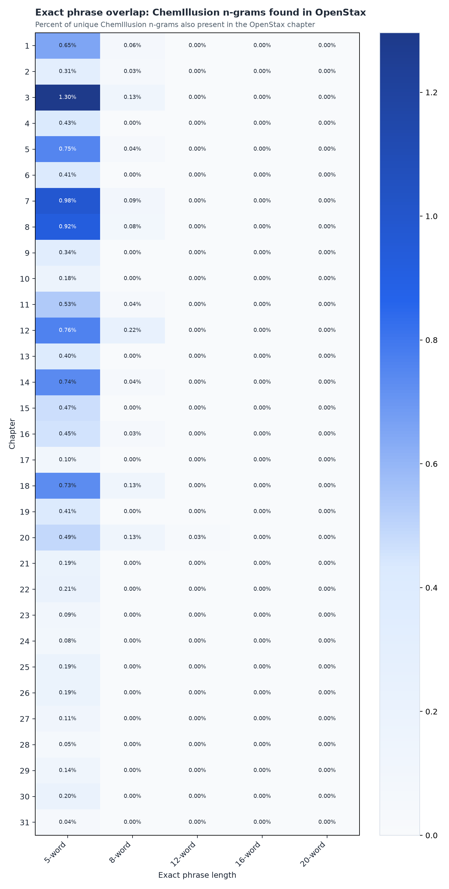
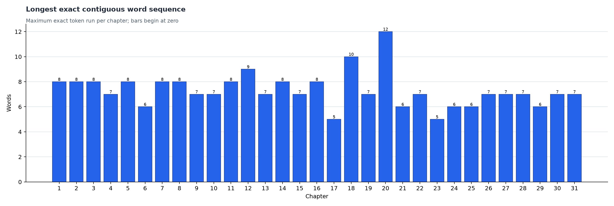
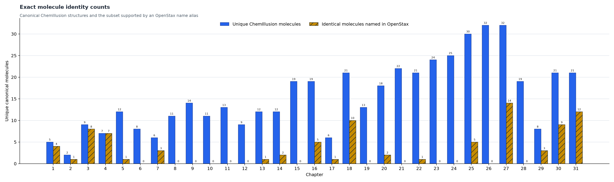
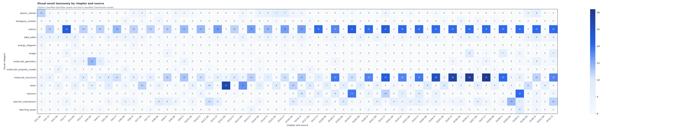

# OpenStax–ChemIllusion full-book comparison results

Requested chapters: 1, 2, 3, 4, 5, 6, 7, 8, 9, 10, 11, 12, 13, 14, 15, 16, 17, 18, 19, 20, 21, 22, 23, 24, 25, 26, 27, 28, 29, 30, 31
Exact phrase lengths: 5, 8, 12, 16, 20 words
Minimum contiguous match block: 8 words

## Full-book quantitative summary

Across chapter-local unique 5-word n-grams, 366 of 124,010 matched (0.30%).

|   n |   chemillusion_unique_ngrams |   common_unique_ngrams | weighted_chemillusion_coverage   |
|----:|-----------------------------:|-----------------------:|:---------------------------------|
|   5 |                       124010 |                    366 | 0.30%                            |
|   8 |                       124518 |                     24 | 0.02%                            |
|  12 |                       124452 |                      1 | 0.00%                            |
|  16 |                       124339 |                      0 | 0.00%                            |
|  20 |                       124218 |                      0 | 0.00%                            |

The longest exact contiguous run was 12 words in Chapter 20.

Name-supported exact identity was found for 89 of 482 chapter-local canonical ChemIllusion molecule records (18.46%).

The inventory contains 531 OpenStax and 1,294 ChemIllusion visual assets.

## Text overlap

|   chapter |   chemillusion_words |   openstax_words |   longest_exact_run_words |   matching_blocks_at_or_above_minimum |
|----------:|---------------------:|-----------------:|--------------------------:|--------------------------------------:|
|         1 |                 1702 |             6851 |                         8 |                                     1 |
|         2 |                 2898 |             7507 |                         8 |                                     1 |
|         3 |                 1551 |             5868 |                         8 |                                     2 |
|         4 |                 1876 |             5365 |                         7 |                                     0 |
|         5 |                 2549 |             7300 |                         8 |                                     1 |
|         6 |                 1704 |             8279 |                         6 |                                     0 |
|         7 |                 1133 |             6708 |                         8 |                                     1 |
|         8 |                 1313 |             7600 |                         8 |                                     1 |
|         9 |                 2647 |             4381 |                         7 |                                     0 |
|        10 |                 2787 |             4518 |                         7 |                                     0 |
|        11 |                 2469 |             8554 |                         8 |                                     1 |
|        12 |                 2237 |             6762 |                         9 |                                     2 |
|        13 |                 3748 |             7887 |                         7 |                                     0 |
|        14 |                 2723 |             5830 |                         8 |                                     1 |
|        15 |                 3917 |             5228 |                         7 |                                     0 |
|        16 |                 3099 |             8090 |                         8 |                                     1 |
|        17 |                 2022 |             7049 |                         5 |                                     0 |
|        18 |                 3016 |             4413 |                        10 |                                     2 |
|        19 |                 3700 |             7772 |                         7 |                                     0 |
|        20 |                 3909 |             5067 |                        12 |                                     1 |
|        21 |                 3754 |             8038 |                         6 |                                     0 |
|        22 |                 3320 |             4128 |                         7 |                                     0 |
|        23 |                 5551 |             5166 |                         5 |                                     0 |
|        24 |                 6297 |             7737 |                         6 |                                     0 |
|        25 |                 7565 |             7202 |                         6 |                                     0 |
|        26 |                11023 |             7603 |                         7 |                                     0 |
|        27 |                 7877 |             5502 |                         7 |                                     0 |
|        28 |                 7697 |             5193 |                         7 |                                     0 |
|        29 |                 4443 |             9233 |                         6 |                                     0 |
|        30 |                 9399 |             4034 |                         7 |                                     0 |
|        31 |                 6881 |             3934 |                         7 |                                     0 |

## Identical molecule counts

|   chapter |   chemillusion_unique_molecules |   identical_molecules_named_in_openstax |   chemillusion_molecule_overlap_fraction |
|----------:|--------------------------------:|----------------------------------------:|-----------------------------------------:|
|         1 |                               5 |                                       4 |                                0.8       |
|         2 |                               2 |                                       1 |                                0.5       |
|         3 |                               9 |                                       8 |                                0.888889  |
|         4 |                               7 |                                       7 |                                1         |
|         5 |                              12 |                                       1 |                                0.0833333 |
|         6 |                               8 |                                       0 |                                0         |
|         7 |                               6 |                                       3 |                                0.5       |
|         8 |                              11 |                                       0 |                                0         |
|         9 |                              14 |                                       0 |                                0         |
|        10 |                              11 |                                       0 |                                0         |
|        11 |                              13 |                                       0 |                                0         |
|        12 |                               9 |                                       0 |                                0         |
|        13 |                              12 |                                       1 |                                0.0833333 |
|        14 |                              12 |                                       2 |                                0.166667  |
|        15 |                              19 |                                       0 |                                0         |
|        16 |                              19 |                                       5 |                                0.263158  |
|        17 |                               6 |                                       1 |                                0.166667  |
|        18 |                              21 |                                      10 |                                0.47619   |
|        19 |                              13 |                                       0 |                                0         |
|        20 |                              18 |                                       2 |                                0.111111  |
|        21 |                              22 |                                       0 |                                0         |
|        22 |                              21 |                                       1 |                                0.047619  |
|        23 |                              24 |                                       0 |                                0         |
|        24 |                              25 |                                       0 |                                0         |
|        25 |                              30 |                                       5 |                                0.166667  |
|        26 |                              32 |                                       0 |                                0         |
|        27 |                              32 |                                      14 |                                0.4375    |
|        28 |                              19 |                                       0 |                                0         |
|        29 |                               8 |                                       3 |                                0.375     |
|        30 |                              21 |                                       9 |                                0.428571  |
|        31 |                              21 |                                      12 |                                0.571429  |

## Visual asset counts

|   chapter | source       |   visual_asset_count |
|----------:|:-------------|---------------------:|
|         1 | ChemIllusion |                   21 |
|         1 | OpenStax     |                   24 |
|         2 | ChemIllusion |                   34 |
|         2 | OpenStax     |                   12 |
|         3 | ChemIllusion |                   25 |
|         3 | OpenStax     |                   17 |
|         4 | ChemIllusion |                   27 |
|         4 | OpenStax     |                   22 |
|         5 | ChemIllusion |                   28 |
|         5 | OpenStax     |                   21 |
|         6 | ChemIllusion |                   27 |
|         6 | OpenStax     |                   15 |
|         7 | ChemIllusion |                   19 |
|         7 | OpenStax     |                   20 |
|         8 | ChemIllusion |                   34 |
|         8 | OpenStax     |                   16 |
|         9 | ChemIllusion |                   33 |
|         9 | OpenStax     |                    9 |
|        10 | ChemIllusion |                   28 |
|        10 | OpenStax     |                    9 |
|        11 | ChemIllusion |                   30 |
|        11 | OpenStax     |                   24 |
|        12 | ChemIllusion |                   22 |
|        12 | OpenStax     |                   31 |
|        13 | ChemIllusion |                   33 |
|        13 | OpenStax     |                   27 |
|        14 | ChemIllusion |                   30 |
|        14 | OpenStax     |                   18 |
|        15 | ChemIllusion |                   39 |
|        15 | OpenStax     |                   18 |
|        16 | ChemIllusion |                   48 |
|        16 | OpenStax     |                   25 |
|        17 | ChemIllusion |                   33 |
|        17 | OpenStax     |                   17 |
|        18 | ChemIllusion |                   50 |
|        18 | OpenStax     |                   14 |
|        19 | ChemIllusion |                   55 |
|        19 | OpenStax     |                   20 |
|        20 | ChemIllusion |                   44 |
|        20 | OpenStax     |                   13 |
|        21 | ChemIllusion |                   62 |
|        21 | OpenStax     |                   15 |
|        22 | ChemIllusion |                   53 |
|        22 | OpenStax     |                   10 |
|        23 | ChemIllusion |                   55 |
|        23 | OpenStax     |                   11 |
|        24 | ChemIllusion |                   56 |
|        24 | OpenStax     |                   13 |
|        25 | ChemIllusion |                   52 |
|        25 | OpenStax     |                   14 |
|        26 | ChemIllusion |                   61 |
|        26 | OpenStax     |                   16 |
|        27 | ChemIllusion |                   59 |
|        27 | OpenStax     |                   20 |
|        28 | ChemIllusion |                   49 |
|        28 | OpenStax     |                   11 |
|        29 | ChemIllusion |                   64 |
|        29 | OpenStax     |                   18 |
|        30 | ChemIllusion |                   58 |
|        30 | OpenStax     |                   21 |
|        31 | ChemIllusion |                   65 |
|        31 | OpenStax     |                   10 |

## Reproducibility

See [`run_manifest.json`](run_manifest.json) for selected-input fingerprints, public-safe source provenance, parameters, and code/configuration hashes.

## Interpretation limits

- Exact phrase overlap measures wording, not conceptual coverage.
- Molecule identity is inferred only when an alias for an exact canonical ChemIllusion molecule appears in OpenStax text. It is not optical structure recognition.
- OpenStax figure categories are inferred from extracted captions; ChemIllusion categories are inferred from reader block types and metadata.
- No fingerprint similarity, Tanimoto score, perceptual image similarity, or visual-density metric is produced.
